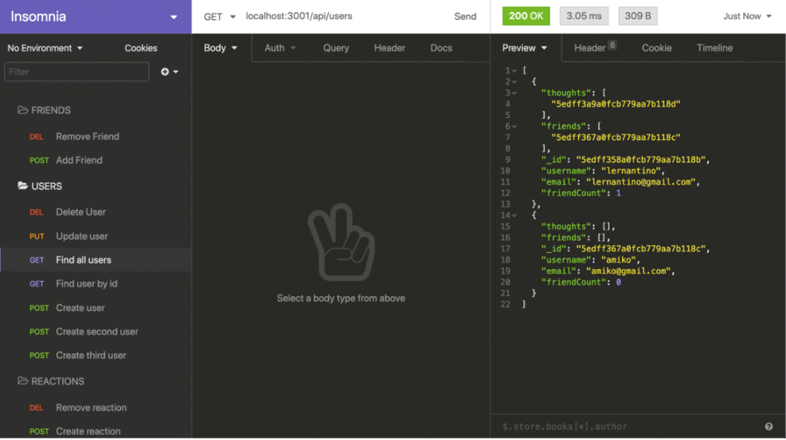

# social-network-api

 

# Links

GitHub Repository: https://github.com/CatCorbin/social-network-api
 
Demo Video: https://drive.google.com/file/d/1OJDJzvG2br_oDlLZjtAyqCE-STobR_SV/view 

## Description

As a social media startup, I want an API for my social network that uses a NoSQL database, so that my website can handle large amounts of unstructured data.

## Table of Contents

- [Installation](#installation)
- [Usage](#usage)
- [License](#license)
- [Contributions](#contributions)
- [Tests](#tests)
- [Questions](#questions)

## Installation

N/A

## Usage

Given a social network API, when I enter the command to invoke the application my server is started and the Mongoose models are synced to the MongoDB database.
When I open API GET routes in Insomnia for users and thoughts the data for each of these routes is displayed in formatted JSON.
When I test API POST, PUT, and DELETE routes in Insomnia I am able to successfully create, update, and delete users and thoughts in my database.
When I test API POST and DELETE routes in Insomnia I am able to successfully create and delete reactions to thoughts and add and remove friends to a user’s friend list.

## License

MIT

## Contributions

None

## Tests

Test using Insomnia

## Questions
<ul>
<li> <a href = "https://github.com/CatCorbin">github profile</a>
</li>
<li> <a href = "mailto:catcorbin0919@gmail.com">email </a> </li>
</li>